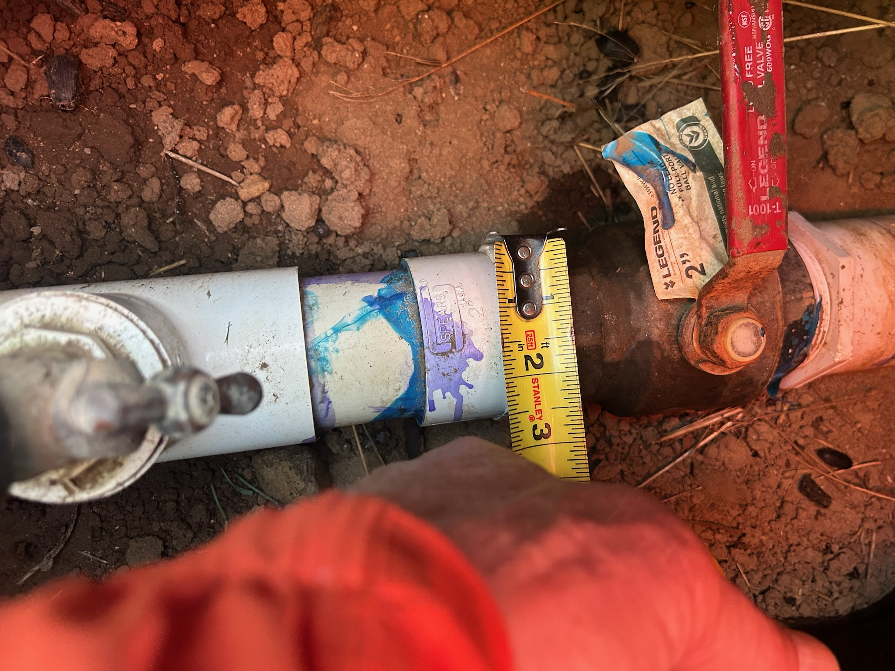

# Project: Irrigation Balancer

## Overview

**One-line description:** Closed-loop orchard flood irrigation — actuated valves plus per-outlet flow-estimating cameras keep water balanced across outlets regardless of inlet pressure

**Project Lead:** TBD
**Team Members:** TBD
**Status:** Proposed

## Description

Many orchard owners flood-irrigate their fields from a single main line that feeds 6+ outlet pipes arranged linearly down the row. Each outlet has its own manually-operated valve, and because the outlets are plumbed in series, every valve change affects the flow at every downstream outlet. Inlet water pressure varies day-to-day, so a setting that waters the whole field evenly one morning can starve the far outlets the next. Balancing the system requires walking the row, cranking stiff valves by hand, eyeballing flow, and iterating — a chore that is physically demanding for the older/retired growers who make up a lot of this user base.

Irrigation Balancer puts a motorized valve controller on each outlet and a cheap weatherproof webcam pointed at the end of each pipe. A vision service watches the water jet/flood pattern and estimates flow rate per outlet. A coordinator service closes the loop: drive all outlets to equal flow, weight them by tree count, or run a configurable per-outlet schedule — and hold that target as inlet pressure drifts. Owners start and stop irrigation from a phone; the system handles the tuning.

This project pushes Viam into outdoor, rugged, distributed deployments with genuinely novel vision (video-as-flowmeter), custom electromechanical hardware design, multi-machine coordination across a field, and a customer-facing app for non-technical users. It's also a real product for a real underserved customer — the kind of thing a nonprofit could deploy at dozens of orchards and monitor as a fleet.




*A representative outlet valve: a 2" Legend brass ball valve with a long steel lever handle, installed below grade in a soil pit. These are the kind of stiff, outdoor, previously-hand-only valves the driver has to move proportionally.*

---

## MVP

Two outlets on a single test run, each with an actuated valve and a camera. The vision service produces a flow estimate per outlet, and a control loop drives both outlets to equal flow by adjusting the valves. Start/stop and target flow split configurable from a Viam Teleop dashboard.

**Stretch:** Scheduled irrigation run (open at 7am, close after 2 hours); mobile app with a big "irrigate now" button.

---

## Viam Capabilities Demonstrated

### Core Capabilities
- [x] **Hardware Integration** — Custom linear-actuator valve drivers, USB/IP cameras, SBC per field
- [ ] **Motion Planning** — Not applicable
- [x] **Vision / ML Inference** — Custom vision service estimates flow rate from video of pipe outlet (classical CV baseline, ML upgrade path)
- [x] **Data Capture & Sync** — Flow readings, valve positions, inlet pressure, weather synced to cloud; offline-resilient (fields may have flaky LTE)
- [x] **Remote Operation** — Owners operate the system from anywhere; techs diagnose remotely
- [x] **Module Development** — Custom flow-estimation vision service; valve-driver component module (linear actuator with "more open" / "more closed" API)
- [x] **Fragments** — Per-field topology (N outlets) as a reusable fragment

### Scale & Fleet Capabilities
- [x] **Fleet Management** — Primary demo: one machine per field, many fields per nonprofit, central monitoring
- [x] **OTA Updates** — Push vision model and control logic updates to all fields via Registry
- [x] **Provisioning** — Fragment-driven setup for each new field

### Operational Capabilities
- [x] **Scheduled Tasks** — Irrigation schedules (time-of-day, duration, days-of-week)
- [x] **Monitoring & Alerting** — Low/zero flow alerts (clog, leak, pressure loss), valve failures, camera offline
- [x] **Data Pipeline (ML Training)** — Video → labeled flow rates (from flow-meter ground truth during calibration) → trained flow estimator → deploy

### Customer-Facing Capabilities
- [x] **Customer Delivery** — Owners are non-technical end users
- [x] **Web/Mobile Apps** — Simple mobile app: start/stop, see per-outlet flow, schedule

## Hardware Requirements

| Component | Description | Options |
|-----------|-------------|---------|
| Valve drivers | One per outlet — likely off the shelf hardware, possibly custom linear-actuator rig that nudges the existing manual valve handle in either direction | Custom build: linear actuator (12/24V, high-force, e.g. Progressive Automations PA-14 class or similar) + 3D-printed or machined coupler to the valve handle + motor controller. Must support bidirectional incremental moves ("open more", "close more") and be strong enough for stiff field valves. No position feedback needed — the camera closes the loop; no endstop sensing needed either — the mechanical design tolerates hitting the valve's limits |
| Cameras | One per outlet, pointed at pipe end | Cheap weatherproof USB webcam or IP camera, likely attached to ESP32 |
| Compute | Per-field controller | Raspberry Pi 4 or similar SBC in a weatherproof enclosure |
| Connectivity | Field-to-cloud | WiFi at the pump house + point-to-point to outlets, or LTE modem, or Matter/LoRa |
| Power | Outlet-side power for camera + actuator | Solar + battery, or a run of 12V along the ditch |
| Cow-proofing | Physical protection | steel cages, fencing around camera gear |

**Remote-Friendly:** Partially — vision/control/app development is fully remote, but MVP hardware bring-up needs someone near a real irrigation run. A bench mock-up (hose + bucket + actuated valves) gets most of the way there for hackathon scope.

---

## Backlog

### Valve Driver Hardware
- [ ] **Bench prototype** — single linear actuator + coupler + motor controller driving one valve on a test rig
- [ ] **Handle coupler design** — non-destructive grip that fits the common field valve handle geometries, with mechanical tolerance for driving into the valve's endstops
- [ ] **Weatherproof enclosure** — IP-rated housing for actuator, controller, and wiring
- [ ] **Field-ready v1** — solar/battery powered, serviceable, cow-proof mounting
- [ ] **Viam component module** — expose the driver with a simple incremental-motion API ("open more", "close more", by N units)

### Flow Estimation
- [ ] **Baseline CV flow estimator** — classical vision (jet width, splash area, frame differencing) to produce a relative flow estimate
- [ ] **Calibration routine** — pair vision output with a reference flowmeter to produce gpm/lps estimates
- [ ] **ML flow estimator** — train a model on labeled video for robustness across outlet geometries and lighting
- [ ] **Per-outlet calibration storage** — each outlet has its own calibration curve (persisted via fragments/config)
- [ ] **Night / low-light handling** — IR illuminator or thermal camera option

### Control
- [ ] **Equal-flow balancer** — iterative controller that equalizes flow across all open outlets
- [ ] **Weighted flow targets** — per-outlet targets based on tree count or zone needs
- [ ] **Pressure-drop compensation** — detect upstream pressure drops and rebalance
- [ ] **Clog/leak detection** — flow much lower/higher than expected for valve position
- [ ] **Graceful shutdown sequence** — close outlets in the right order to avoid water hammer

### Scheduling & Automation
- [ ] **Irrigation schedules** — time-of-day, duration, days-of-week per field
- [ ] **Weather-aware scheduling** — skip runs if recent rainfall exceeds threshold
- [ ] **Soil moisture integration** — only irrigate zones that need it
- [ ] **Water budget tracking** — daily/weekly/seasonal volume per field

### Monitoring & Alerting
- [ ] **Zero-flow alert** — outlet commanded open but no flow detected
- [ ] **Valve failure detection** — commanded open/close doesn't produce expected flow change
- [ ] **Camera offline alerts** — control falls back to last-known-good or pauses irrigation
- [ ] **End-of-run summary** — push notification with volumes per outlet

### Customer App
- [ ] **"Irrigate now" button** — one-tap start with last-used settings
- [ ] **Live per-outlet flow view** — visual at-a-glance status
- [ ] **Simple schedule editor** — designed for non-technical users
- [ ] **Multi-field selector** — growers with multiple fields

### Ruggedization & Field Ops
- [ ] **Weatherproof enclosures** — for compute, cameras, cables
- [ ] **Cow-proof mounting** — T-posts, cages, breakaway cable routing
- [ ] **Solar power for remote outlets** — small panel + LiFePO4 battery
- [ ] **Mesh/point-to-point networking** — outlet cameras back to pump house
- [ ] **Offline operation** — complete irrigation run without cloud connectivity

### Fleet (Nonprofit Operator)
- [ ] **Multi-field dashboard** — all fields across all growers in one view
- [ ] **Remote diagnostics** — support tech can debug a field without driving out
- [ ] **Fleet-wide OTA** — push improved flow estimator to all fields
- [ ] **Water usage reporting** — aggregate usage across the fleet for grant/funder reporting

---

## Stretch Goals

- [ ] Pressure-and-flow model of the whole line (physics-based) for feedforward control
- [ ] Closed-loop control against soil moisture instead of flow — irrigate to a target soil state
- [ ] Drone or fixed-mast orchard imaging to correlate irrigation with tree health
- [ ] Integration with groundwater/well pump control
- [ ] Frost protection mode (run irrigation during freeze events)
- [ ] Multi-tenant nonprofit deployment — each grower is an org in Viam, nonprofit has oversight

---

## Links

- **Jira Epic:** [TBD]
- **GitHub Repo:** [TBD]
- **Viam Organization:** [TBD]
- **Hardware BOM:** [TBD]

---

## Technical Details

### System Topology

```
                      ┌─── Outlet 1 ───┐   ┌─── Outlet 2 ───┐       ┌─── Outlet N ───┐
Main line ── main ────┤                ├───┤                ├── ... ┤                ├─── end cap
            valve     │ actuated valve │   │ actuated valve │       │ actuated valve │
                      │ + camera       │   │ + camera       │       │ + camera       │
                      └────────────────┘   └────────────────┘       └────────────────┘
                              │                   │                         │
                              └ WiFi/Matter/LoRa ─┴─────────────────────────┘
                                              │
                                      ┌───────▼────────┐
                                      │ Field SBC      │  ──── LTE/WiFi ──── Viam cloud
                                      │ (Viam machine) │
                                      └────────────────┘
```

Outlets are plumbed in series, so outlet 1's valve position affects flow at every outlet downstream. The control loop has to account for this coupling — opening outlet 1 reduces available flow for outlets 2..N.

### Flow Estimation Approaches

**v0 (baseline, classical CV):** Fixed camera pointed at the pipe outlet. Compute per-frame:
- Jet/stream cross-section area or splash footprint
- Frame-to-frame motion magnitude (optical flow in the water region)
- Time-averaged to smooth turbulence

Calibrate against a reference flowmeter at a handful of flow rates to produce a per-outlet curve. Good enough for relative balance across outlets.

**v1 (ML):** Train a small model on video clips labeled with flow from a reference meter, across outlet types, lighting, and water clarity. Deploy via Registry.

### Control Loop

Simple proportional controller in v0:
1. Read flow estimate per outlet (averaged over a window)
2. Compute error vs. target
3. Nudge each outlet's valve position
4. Wait for system to settle; iterate

The coupling between outlets means naive per-outlet control will oscillate. v1 should treat the field as a coupled system (e.g., fit a crude flow-vs-valve-position Jacobian online and invert it).

### Valve Driver Design

Off-the-shelf options may not fit the requirements:
- **Clamp-on ball valve actuators** (the Matter-over-WiFi ones, smart-home style) are designed for household shutoffs — almost always on/off only, and the ones that do offer partial control don't have the torque for a stiff, rarely-turned field valve.
- **Irrigation solenoids** are proportional-ish but require replacing the existing valves outright — bigger plumbing job, and owners lose the ability to operate the valve by hand as a fallback.

So the project potentially includes a custom valve driver: a linear actuator coupled to the valve handle, capable of nudging it more open or more closed on command. Key requirements:
- **Bidirectional incremental control** — accept "open more" / "close more" commands of varying magnitude; arbitrary partial-open states emerge from the control loop, not from absolute positioning
- **High torque** — enough to move valves that have been sitting stiff for a season
- **Non-destructive coupling** — grip the existing handle without modifying the valve body; ideally removable so manual operation stays available
- **Tolerant of hitting endstops** — the mechanical design (actuator stroke matched to valve travel, slip/compliance at the coupler, or similar) handles the "drive into the limit" case without damage, so no electrical endstop sensing is required
- **Weatherproof and field-powered** — runs off 12V with solar/battery, IP-rated enclosure

**Design note:** We deliberately skip both absolute position feedback (pot, encoder) and endstop sensing on the actuator. The camera is the feedback loop — what we actually care about is flow at the outlet, not where the valve handle is — and the mechanical design absorbs the endstop case. That keeps the actuator dumb, cheap, swappable, and electrically simple (just motor power).

This is a mechanical-design sub-project in its own right. A bench version (actuator clamped to a single valve on a test rig) is the first milestone; a field-ready, cow-proof version comes later in the backlog.

Viam-side, this becomes a custom component module exposing a simple incremental-motion API, so the control-loop code doesn't care whether it's driving our custom rig or a future COTS replacement.

---

## Notes

**Why this project is compelling:**
- Real, underserved customer (aging orchard owners) with a physical chore the platform can genuinely remove
- Exercises Viam capabilities that most manipulation projects don't: outdoor rugged deployment, fleet-across-sites, custom electromechanical hardware + component module, video-as-sensor
- Natural fleet story — one machine per field, many fields per nonprofit operator
- Customer-facing app for non-technical users is a good forcing function for delivery polish
- Good content: flood irrigation before/after, balancing demo, a cow knocking over a camera

**Risk Factors:**
- Flow estimation from video is the core technical bet — if relative ranking works but absolute calibration is noisy, the control loop still works; if even relative ranking is unreliable, we need a real flowmeter per outlet and the project shape changes
- Outdoor connectivity (WiFi + LTE) is historically a source of subtle bugs — offline resilience matters
- MVP requires either access to a real orchard run or a convincing bench mock-up (hose + manifold + buckets)
- Cows. Genuinely.

**Gap Features This Project Addresses:**
- **Fleet Management** — natural multi-site, multi-machine-per-site deployment
- **Customer Delivery / Apps** — non-technical end users operating real hardware
- **Event-Driven Automation** — closed-loop control based on vision-derived sensor readings
- **Vision as Sensor** — flow estimation is a non-obvious use of the vision service
- **Custom Hardware / Module Development** — designing an electromechanical valve driver and wrapping it as a standard Viam component
